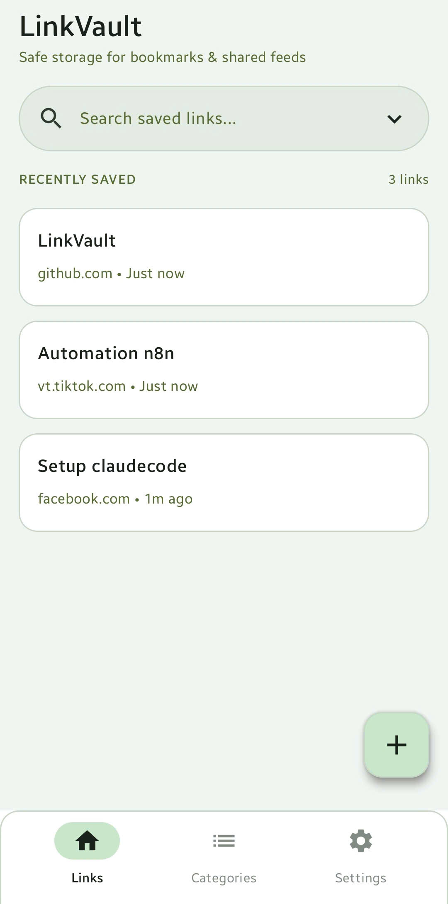
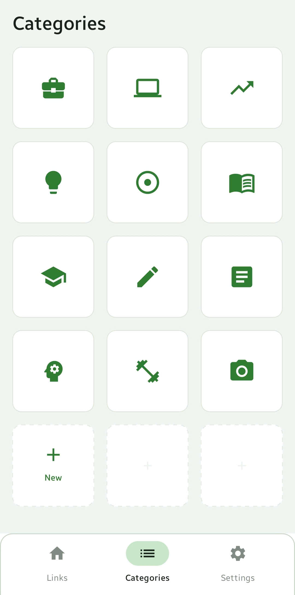
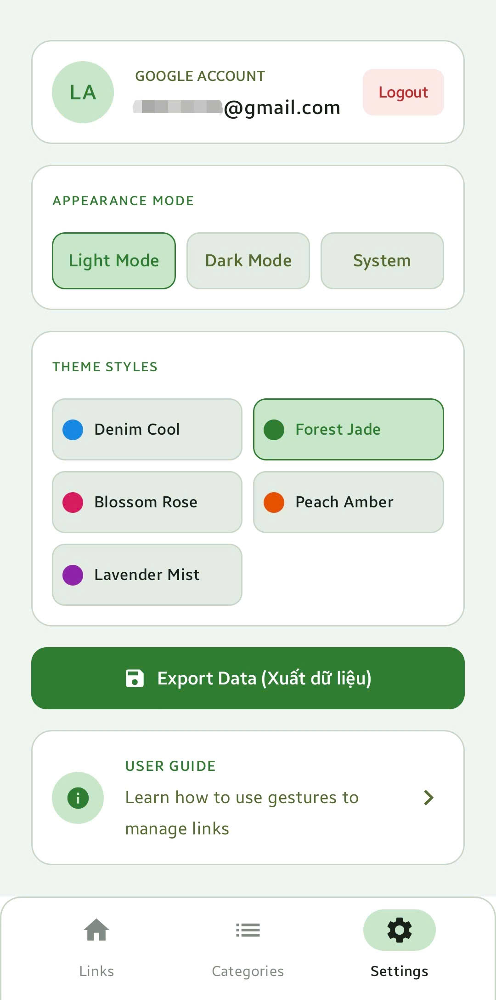

# LinkVault

**Save every useful link. Find it again when you need it.**

LinkVault is a clean, local-first Android app for collecting links from the web, social apps, chats, and anywhere Android sharing works. Instead of losing useful URLs in messages, notes, or browser tabs, LinkVault gives you one focused place to save, categorize, search, and export them.

## Why LinkVault?

- **Capture links fast** — save manually or share text/URLs directly from other Android apps.
- **Stay organized** — group links into categories, add notes, and tag important items.
- **Find anything quickly** — search by title, URL, note, or tag.
- **Keep control of your data** — links are stored locally on your device with a separate vault per signed-in Google account.
- **Make it yours** — choose light, dark, or system theme and switch between multiple color styles.
- **Take your data with you** — export saved links to CSV for backup or sharing.

## App Screens

| Links | Categories | Settings |
| --- | --- | --- |
|  |  |  |

## Main Features

### Links

Save links with a title, URL, note, tags, and category. Sort by recent date, title, or domain, then swipe to edit or delete when your vault needs cleanup.

### Categories

Create visual categories with built-in or custom logos. Reorder categories by drag and drop so your most important collections stay within reach.

### Settings

Personalize the app theme, manage account access, and export your saved data to CSV.

## Built With

- Kotlin
- Jetpack Compose
- Material 3
- Room local database
- Kotlin Coroutines and Flow
- Google account picker

## Getting Started

1. Open the project in Android Studio.
2. Sync Gradle dependencies.
3. Run the `app` configuration on an emulator or Android device.

## Development Commands

| Command | Description |
| --- | --- |
| `./gradlew assembleDebug` | Build a debug APK |
| `./gradlew test` | Run local tests |
| `./gradlew connectedAndroidTest` | Run Android instrumented tests |

On Windows, use `./gradlew.bat` if the Gradle wrapper is available.

## Privacy & Security

LinkVault is designed around local storage. Avoid committing generated APKs, keystores, `.env` files, or Firebase configuration files to the repository.

## Current App Details

- App name: **LinkVault**
- Application ID: `com.aistudio.linkvault.lxkqpz`
- Minimum SDK: 24
- Target SDK: 36
